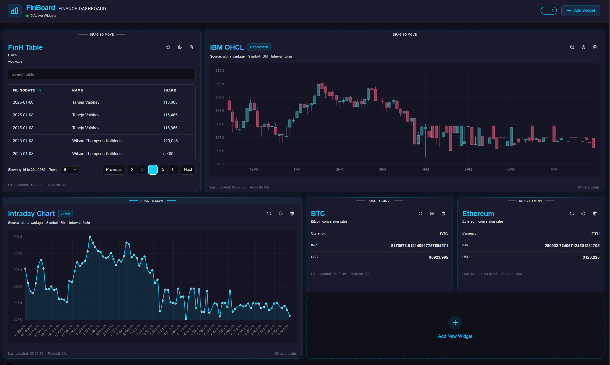
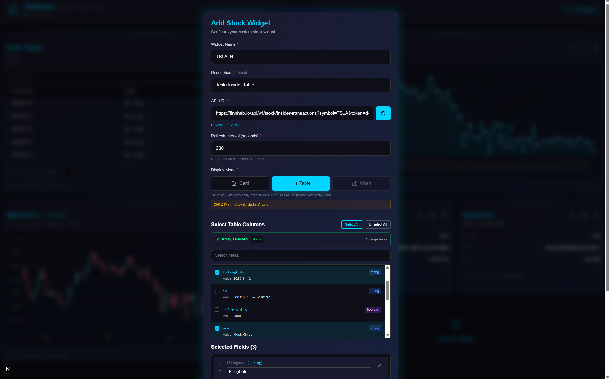
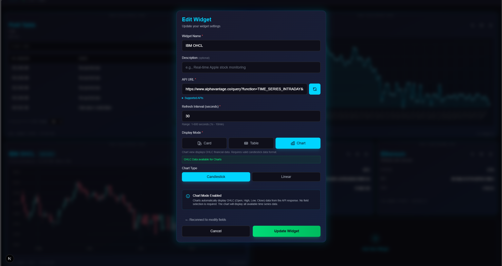
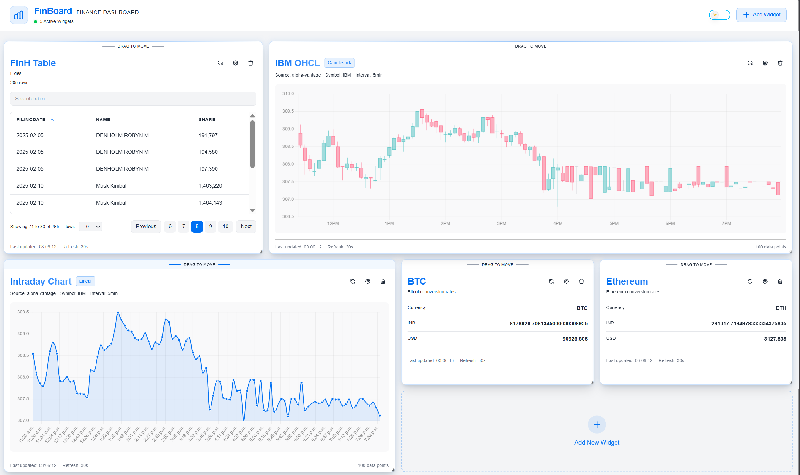

# FinBoard - Financial Dashboard

FinBoard is a highly customizable, modular, and scalable financial dashboard designed to visualize real-time market data. It allows users to create a personalized workspace with various widget types, supporting custom API integrations and flexible data mapping.



## Live Demo

Check out the live application deployed on Vercel:
**[https://finboard-ecru.vercel.app/](https://finboard-ecru.vercel.app/)**

## Getting Started

1.  **Clone the repository**
    ```bash
    git clone https://github.com/Mayankrai449/finboard.git
    cd finboard
    ```

2.  **Install dependencies**
    ```bash
    npm install
    ```

3.  **Run the development server**
    ```bash
    npm run dev
    ```

4.  Open [http://localhost:3000](http://localhost:3000) with your browser to see the result.

## Features

### Versatile Widget Types
- **Stock Cards**: Display key metrics and real-time price updates.
- **Data Tables**: Comprehensive views with built-in **pagination** and **search** capabilities.
- **Charts**: Interactive visualizations using **Chart.js**, supporting both **Candlestick** and **Linear** charts for OHLC (Open, High, Low, Close) data.

### Customization & Usability
- **Drag & Drop Layout**: Fully customizable grid layout using `react-grid-layout`. Organize your workspace exactly how you want it.
- **Resizable Widgets**: Adjust the size of any widget to fit your needs.
- **Custom API Support**: Connect to any JSON-based API.
- **Configurable Fields**: Select exactly which data points to display using a powerful field selector with search functionality.
- **Edit & Reconfigure**: Easily modify existing widgets to change data sources, fields, or visualization settings.
- **Dark/Light Mode**: Seamless theme switching with smooth transitions and a persistent preference setting.

### Performance & Reliability
- **Real-time Data**: Automatic polling with configurable refresh intervals for each widget.
- **Server-Side Caching**: Optimized API requests with server-side *caching* to reduce rate limits and improve load times.
- **Robust Error Handling**: Graceful handling of API failures and network issues for a smooth user experience.
- **Data Persistence**: Your dashboard configuration and layout are automatically saved and restored in browser's *local storage*.

### Technical Highlights
- **Smart Data Mapping**: Advanced data mappers handle various JSON structures, automatically flattening nested responses for easy selection.
- **Redux State Management**: Centralized state for predictable data flow and widget management.
- **Modular Architecture**: Built with scalability in mind, making it easy to add new widget types or features.


### Add Widget Form
*Intuitive form to connect APIs and select data fields.*


### Edit Configuration
*Modify widget settings, refresh rates, and data mappings on the fly.*


### Light Mode

## Supported API Sources

FinBoard includes built-in support and data mapping for major financial data providers, but is flexible enough to handle custom endpoints:

1.  **Alpha Vantage**
2.  **Twelve Data**
3.  **Finnhub**
4. **IndianAPI**

## Tech Stack

-   **Framework**: [Next.js](https://nextjs.org/)
-   **Styling**: [Tailwind CSS](https://tailwindcss.com/)
-   **State Management**: [Redux Toolkit](https://redux-toolkit.js.org/)
-   **Layout Engine**: [React Grid Layout](https://github.com/react-grid-layout/react-grid-layout)
-   **Charts**: [Chart.js](https://www.chartjs.org/)
